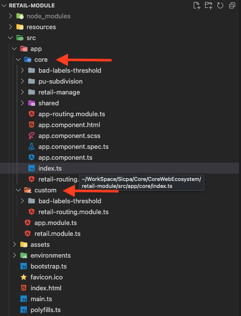

# Customization an Angular project using inheritance

Bibligrafía: https://www.typescriptlang.org/docs/handbook/2/classes.html

## Project Structure

### File Structure

To avoid merge conflict between core updates and customizations it is necessary to have two work file trees.

- core
- custom

In this way core and custom files will be separated. To reuse the core and take advantage of the updates the custom elements extend from their core
counterparts. (Details)



To maintain consistency customization should follow the same file structure as core. So the custom element will be in the same relative path as its
counterpart. Custom element (extended) will have a mirror path of its parent from core.

Only the root modules (``AppModule``, ``MainModule``) will be direct children of the app. And only they will receive conflicts as a result of the updates.

### Index routing for inheritance

Core will have an ``index.ts`` file that exports all core elements that can be extended or imported from the custom module. This is not necessary, but
abstracts to custom module of core parent location.

```ts
// Example index.ts content

export { BadLabelsThresholdComponent } from './bad-labels-threshold/bad-labels-threshold.component';
export { PuSubdivisionComponent } from './pu-subdivision/pu-subdivision.component';
export { ConfirmationComponent } from './pu-subdivision/confirmation/confirmation.component';
export { RetailManageComponent } from './retail-manage/retail-manage.component';
export { SearchRetailComponent } from './retail-manage/search-retail/search-retail.component';
export * from './shared';
```

> **⚠️ Nota:** Line ``export * from './shared';`` export another ``index.ts`` content located in shared. This could be an improvement to avoid having too big a file.

### Custom root routing module (AppRoutingModule)

To create a custom routing module, it is necessary to customize anything. Inheritance is not applied over Angular Modules class is usually empty.

#### To create a new module in custom folder (src/app/custom).

- Create a new module
```
ng generate module custom/app-routing --flat
```

- Add RoutingModule from angular route.
- Create routes like core routing or copy the module.
- Update routes.


```ts
// Routing module example

import { NgModule } from '@angular/core';
import { RouterModule, Routes } from '@angular/router';
import { HasPermissionGuard, PendingChangesGuard } from '@sicpa/auth-lib';
import { PuSubdivisionComponent } from 'src/app/core';
import { CustomBadLabelsThresholdComponent } from './bad-labels-threshold/bad-labels-threshold.component';

const routes: Routes = [
    {
        path: 'puSubdivision',
        component: PuSubdivisionComponent,
        canActivate: [HasPermissionGuard],
        canDeactivate: [PendingChangesGuard],
        data: {
            role: 'security.permission.value.puSubdivision'
        }
    },
    {
        path: 'badLabelsThreshold',
        component: CustomBadLabelsThresholdComponent,
        canActivate: [HasPermissionGuard],
        canDeactivate: [PendingChangesGuard],
        data: {
            role: 'security.permission.value.badLabelsThresholdPU'
        }
    }
]

@NgModule({
    declarations: [],
    imports: [
        RouterModule.forChild(routes)
    ],
    exports: [RouterModule]
})
export class CustomRetailRoutingModule { }
```

To update routes it is posible adding modules, components and others from core, overwrite someones, create newones or remove them.

- CustomRoutingModule should replase to CoreRotingModule in root module.

```ts
// Root Module example

...
// import { RetailRoutingModule } from './core/retail-routing.module';
import { CustomRetailRoutingModule } from './custom/custom-retail-routing.module';
import { SharedModule } from './core/shared/shared.module';
...
@NgModule({
    declarations: [
        ...
],
    imports: [
        // RetailRoutingModule,
        CustomRetailRoutingModule,
        SharedModule
    ],
    providers: [
        ...
]
})
export class RetailModule { }
```

## TypeScript inheritance on Angular

## Interface Inheritance

There are several way to apply interface inheritance on TypeScript.


[Interface documentation](https://www.typescriptlang.org/docs/handbook/2/everyday-types.html#interfaces)

```ts
// Parent Interface

export interface IParentUserModel {
    id: number;
    name: string;
    email: string;
    date: Date;
}
```

Standar extend. Extends every parent attributes and, can add new ones.
```ts
// Standar extend

import { IParentUserModel } from "src/app/parent/models/parent-user.model";

export interface IChildUserModel extends IParentUserModel {
    status: boolean;
}
```
Partial extend. Extends every parent attributes as optional, can add new ones.
<br>
``{ id?: string, name?: string, ... }``

```ts
// Partial extend

import { IChildUserModel } from "src/app/child/models/child-user.model";

export interface IPartialChildModel extends Partial<IChildUserModel> { }
```

Omit extend. Extends every parent attributes except mentioned (id, status), can add new ones.

```ts
// Omit extend

import { IChildUserModel } from "src/app/child/models/child-user.model";

export interface INewChildModel extends Omit<IChildUserModel, 'id' | 'status'> {
    password: string;
}
```
Pick extend. Extends only parent attributes mentioned (email), can add new ones.
```ts
// Pick extend

import { IChildUserModel } from "src/app/child/models/child-user.model";

export interface ILoginUserModel extends Pick<IParentUserModel, 'email'> {
    password: string;
}
```

## Class Inheritance

To extend a class, the word "``extends``" is used, inheritance is declared directly after the class name and before the implementations. It's just can inherit
from a parent class.
It is mandatory to call the constructor of the parent class in the constructor of our class.
The attributes and functions that you want to inherit must be visibility protected or public, never private.

[TypeScript Documentation Class](https://www.typescriptlang.org/docs/handbook/2/classes.html)

```ts
// Class Inheritance

import { SimpleParent } from 'src/app/parent';

export class SimpleChild extends SimpleParent {

    constructor() {
        super();
    }
}
```

### Overwrite

Public and protected attributes and functions can be overridden. The overwritten elements are the ones used by default. It is possible to call the original function once it has been overridden, but it must be done explicitly (super.function). The rest of the attributes that are not functions are not accessible using (``super``).
<br>
Example: "src/app/child/pages/child-page/child-page.component.ts"

### OPP Principles

Here, there is a documentation about **SOLID** principles. It could be good check it mainly **Open-close principle**, because this article is based on it.

## Services Inheritance

Extend an Angular service is so similar to extend another kind of class in TypeScript.

```ts
// Service parent with dep

import { Injectable } from '@angular/core';
import { BehaviorSubject, Observable } from 'rxjs';

@Injectable({
    providedIn: 'root'
})
export class SingleParentService {
    protected readonly status = new BehaviorSubject<number>(0);
    public readonly status$: Observable<number> = this.status.asObservable();

    constructor() { }

    setStatus(data: number): void {
        this.status.next(data);
    }

    getStatus(): Observable<number> {
        return this.status$;
    }
}
```

```ts
// Service simple child

import { Injectable } from '@angular/core';
import { SingleParentService } from 'src/app/parent';

@Injectable({
    providedIn: 'root'
})
export class CustomSingleChildService extends SingleParentService {

    constructor() {
        super();
    }

    setStatus(data: number): void {
        super.setStatus(data);
        console.log(`CustomSingleChildService: status setted to ${data}.`);
    }
}
```

The most important to take account is the dependency injection applied on service constructor must not be private. Neither in the father nor in the son.

```ts
// Service parent with dep

import { Injectable } from '@angular/core';
import { BehaviorSubject, Observable } from 'rxjs';
import { Logger } from 'src/app/services/logger.service';

@Injectable({
    providedIn: 'root'
})
export class StandardDepService {
    protected readonly status = new BehaviorSubject<number>(0);
    public readonly status$: Observable<number> = this.status.asObservable();
    
    constructor(protected logger: Logger) { }
    
    setStatus(statusNumber: number): void {
        this.status.next(statusNumber);
        this.logger.log(`StandardDepService: status change to ${statusNumber}.`);
    }
}
```

```ts
// Service child with dep

import { Injectable } from '@angular/core';
import { StandardDepService } from 'src/app/parent/services/standard-dep.service';
import { Logger } from 'src/app/services/logger.service';

@Injectable({
    providedIn: 'root'
})
export class StandardDepChildService extends StandardDepService {

    constructor(protected logger: Logger) {
        super(logger);
    }

    setStatusToOne(): void {
        this.status.next(1);
    }
}
```

It is possible to use inheritance on dependecy injection, that allow polymorphic substitutions. (There is an example on Component Inheritance)

## Components Inheritance

Extend an Angular component is so similar to extend another kind of class in TypeScript. Apply dependency injection is equal to Angular services. The main difference is related to the external tributes to the class: (template, css styles, etc). These attributes are diffined in Component decorator.

Parent and child component could have equal selector but it is recommended it would be defferent. Because if both of them are required at the same Angular Module then Angular will throw a building error.

The attributes of the component are independent of class extension. It is possible to reuse the parent component's template and styles, but they must be added explicitly in the component's decorator.

## Pipes Inheritance


## Guards Inheritance


## Modules Inheritance


## Index routing

To create an index.ts file that exports all parent classes that can be extended or imported from the child module. This is not necessary, but abstracts to child classes of parent location.

```
export { SingleParentService } from './services/single-parent.service';
export * from './shared';
```


Los page components no ejecutan funciones heredadas del ciclo de vida del componente.

Los componentes incluidos dentro de otros si lo hacen.